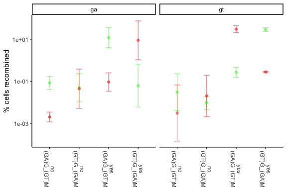

Recombinastics\_analysis
================
Kenneth Matreyek
6/17/2020

``` r
rm(list = ls())
library(tidyverse)
```

    ## ── Attaching packages ────────────────────────────────────────────────────────────────────────────────────── tidyverse 1.3.0 ──

    ## ✓ ggplot2 3.3.1     ✓ purrr   0.3.4
    ## ✓ tibble  3.0.1     ✓ dplyr   1.0.0
    ## ✓ tidyr   1.1.0     ✓ stringr 1.4.0
    ## ✓ readr   1.3.1     ✓ forcats 0.5.0

    ## ── Conflicts ───────────────────────────────────────────────────────────────────────────────────────── tidyverse_conflicts() ──
    ## x dplyr::filter() masks stats::filter()
    ## x dplyr::lag()    masks stats::lag()

``` r
library(ggrepel)
library(reshape)
```

    ## 
    ## Attaching package: 'reshape'

    ## The following object is masked from 'package:dplyr':
    ## 
    ##     rename

    ## The following objects are masked from 'package:tidyr':
    ## 
    ##     expand, smiths

``` r
library(abind)
```

## Look at the recombination method test dasta

``` r
methods_data <- read.csv(file = "data/Recombination_method_tests.csv", header = T)

methods_data_replicates <- ncol(methods_data) - 5
methods_data$mean <- rowMeans(methods_data[,c("Recombined_Rep1","Recombined_Rep2","Recombined_Rep3","Recombined_Rep4")], na.rm = T)
methods_data$sd <- sqrt((methods_data$Recombined_Rep1 - methods_data$mean)^2 + 
                        (methods_data$Recombined_Rep2 - methods_data$mean)^2 + 
                        (methods_data$Recombined_Rep3 - methods_data$mean)^2 +
                        (methods_data$Recombined_Rep4 - methods_data$mean)^2) 
methods_data$se <- methods_data$sd / sqrt(methods_data_replicates - 1)

methods_data$upper_conf <- methods_data$mean + methods_data$se * 1.96
methods_data$lower_conf <- methods_data$mean - methods_data$se * 1.96

methods_data2 <- methods_data %>% filter(!is.na(Recombined_Rep1) & Method != "none") %>% mutate(concat = paste("Method: ",Method,"\n","Bxb1: ",Bxb1,sep = ""))
methods_data2$WellSize <- factor(methods_data2$WellSize)
methods_data2$concat <- factor(methods_data2$concat, levels = methods_data2$concat[c(1,3,2,4)])

methods_data2[methods_data2$lower_conf < 0,"lower_conf"] <- 0

Recombination_method_plot <- ggplot() + 
  theme_classic() + theme(axis.text.x = element_text(angle = -90, vjust = 0.5)) +
  scale_y_continuous(expand = c(0,0), limits = c(0,65)) +
  ylab("% mCherry positive cells") +
  xlab(NULL) +
  geom_hline(yintercept = 0) + 
  geom_errorbar(data = methods_data2, aes(x = concat, ymin = lower_conf, ymax = upper_conf, color = WellSize), 
                width = 0.2, position=position_dodge(width=0.3), size = 0.3 ) +
  geom_point(data = methods_data2, aes(x= concat, y=mean, color = WellSize), 
             position=position_dodge(width=0.3), shape = 95, size = 2) +
  geom_jitter(data = methods_data2, aes(x= concat, y=Recombined_Rep1, color = WellSize), 
             size = 0.9, position=position_dodge(width=0.3), alpha = 0.4) +
  geom_jitter(data = methods_data2, aes(x= concat, y=Recombined_Rep2, color = WellSize), 
             size = 0.9, position=position_dodge(width=0.3), alpha = 0.4) +
  geom_jitter(data = methods_data2, aes(x= concat, y=Recombined_Rep3, color = WellSize), 
             size = 0.9, position=position_dodge(width=0.3), alpha = 0.4) +
  geom_jitter(data = methods_data2, aes(x= concat, y=Recombined_Rep4, color = WellSize), 
             size = 0.9, position=position_dodge(width=0.3), alpha = 0.4)
print(Recombination_method_plot)
```

<!-- -->

# This chunk is for importing the data

``` r
rep_1_frame <- read.csv(file = "data/GT_vs_GA_200206.csv", header = T, stringsAsFactors = F) %>% arrange(attp, bxb1, mix) %>% filter(bxb1 != "none")
rep_2_frame <- read.csv(file = "data/GT_vs_GA_200213.csv", header = T, stringsAsFactors = F) %>% arrange(attp, bxb1, mix) %>% filter(bxb1 != "none")
rep_3_frame <- read.csv(file = "data/GT_vs_GA_200219.csv", header = T, stringsAsFactors = F) %>% arrange(attp, bxb1, mix) %>% filter(bxb1 != "none")

replicates <- 2
rep_1 <- log10(rep_1_frame[,5:8])
rep_2 <- log10(rep_2_frame[,5:8])
rep_3 <- log10(rep_3_frame[,5:8])
means <- (rep_1 + rep_2 + rep_3)/3

#https://stackoverflow.com/questions/32609926/performing-element-wise-standard-deviation-in-r-with-two-matrices
m <- abind(rep_1, rep_2, rep_3, along=3)
standard_devs <- data.frame(apply(m, 1:2, sd))
standard_errors <-  standard_devs / sqrt(replicates)

upper_conf <- means + standard_errors * 1.96
lower_conf <- means - standard_errors * 1.96

label_frame <- rep_1_frame[,1:4] %>% mutate(comboname = paste(bxb1, mix, sep = "\n"))

means2 <- cbind(label_frame,means)
upper_conf2 <- cbind(label_frame,upper_conf)
lower_conf2 <- cbind(label_frame,lower_conf)
#ga_data_filtered$attp <- factor(ga_data_filtered$attp, levels = c("gt","ga"))

GT_vs_GA_plot <- ggplot() + 
  theme_classic() + theme(axis.text.x = element_text(angle = -90, vjust = 0.5)) +
  ylab("% cells recombined") +
  xlab(NULL) +
  scale_y_log10() +
  geom_errorbar(data = upper_conf2, aes(x = comboname, color = mix, ymin = 10^lower_conf2$gfp, ymax = 10^upper_conf2$gfp), color = "green", alpha = 0.5, width = 0.2) +
  geom_errorbar(data = upper_conf2, aes(x = comboname, color = mix, ymin = 10^lower_conf2$mcherry, ymax = 10^upper_conf2$mcherry), color = "red", alpha = 0.5, width = 0.2) +
  #geom_errorbar(data = upper_conf2, aes(x = comboname, color = mix, ymin = 10^lower_conf2$both, ymax = 10^upper_conf2$both), color = "orange", alpha = 0.5, width = 0.2) +
  geom_point(data = means2, aes(x = comboname, color = mix, y = 10^gfp), color = "green", alpha = 0.5) +
  geom_point(data = means2, aes(x = comboname, color = mix, y = 10^mcherry), color = "red", alpha = 0.5) +
  #geom_point(data = means2, aes(x = comboname, color = mix, y = 10^both), color = "orange", alpha = 0.5) +
  facet_wrap(~attp)
print(GT_vs_GA_plot)
```

    ## Warning: Use of `upper_conf2$gfp` is discouraged. Use `gfp` instead.

    ## Warning: Use of `upper_conf2$mcherry` is discouraged. Use `mcherry` instead.

<!-- -->
